# Typical-digital-circuit-blocks

## 典型数字电路模块

>现代编程就是拼积木
>
>软件在能够复用前必须先能用。——Ralph Johnson

此仓库记录制作出的积木以方便**未来复用**，当然前提是这些模块都已经过**FPGA原型验证**。  
Contact me:<feiguan66@gmail.com> or WeChat:feiguan6
##### 文件夹说明:
`project`:项目集  
`sources_1/new`:design文件  
`sim_1/new`:simulation文件
___
### 目录:
1. [逻辑运算器和数据选择器](#1)  
2. [五人表决器](#2)
2. [普通编码器和优先级编码器](#3)
2. [运算器](#4)
2. [触发器](#5)
2. [分频器](#6)
2. [移位寄存器](#7)
2. [状态机](#8)

#### 1. [逻辑运算器和数据选择器](./poject/1-MUXandLU)  
与、或、异或三个门的逻辑运算`First`:  
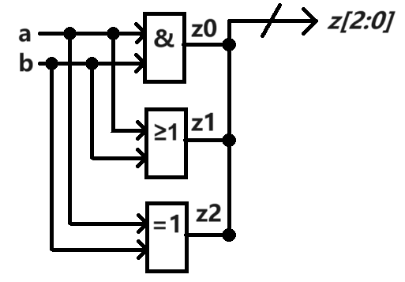   
2选1选择器`MUX2-1`:  
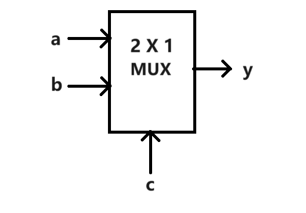  
4选1选择器`MUX4-1`:  
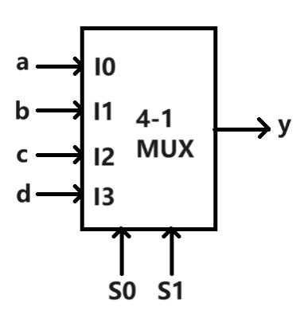  
一个具有多功能逻辑运算单元LU电路`LU`:  
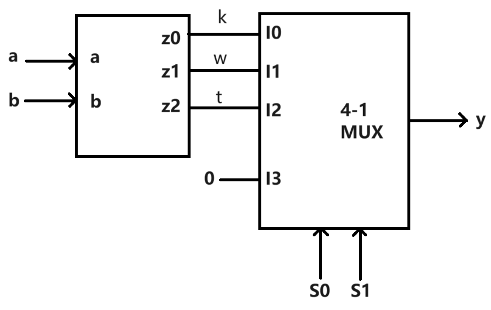    

#### 2. [五人表决器](./project/2-Voter_5_dip)
5人表决器`Vote_5`:  
    
数码管显示译码控制电路`display`:  
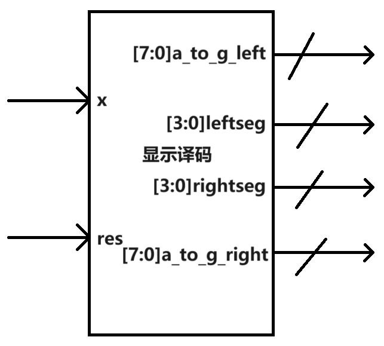    
带数码管显示的5人表决器`Voter_5_dip`:  
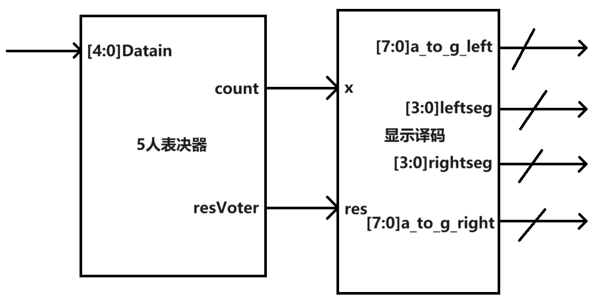    

#### 3. [普通编码器和优先级编码器](./project/3-Priority_Encode_display)
普通编码器`Encode_display`:  
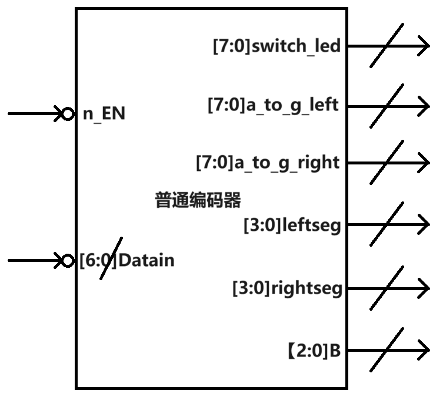    
优先权编码器`Priority_Encode_display`:  
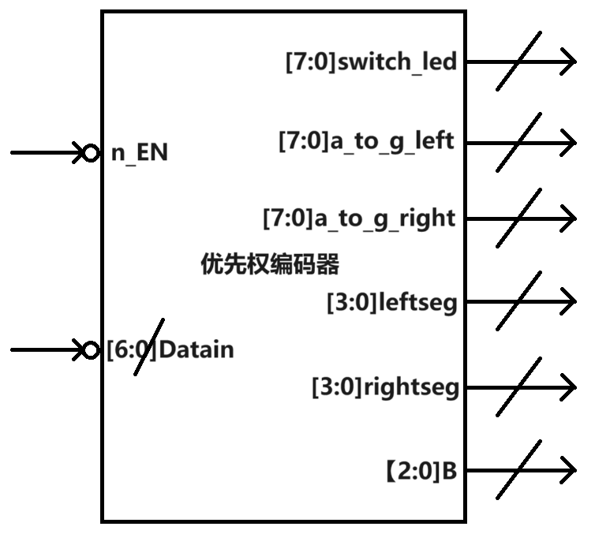    

#### 4. [运算器](./project/4-operator_display)
4位二进制数比较器`compare`:  
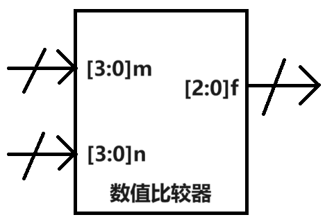    
compare rule:  
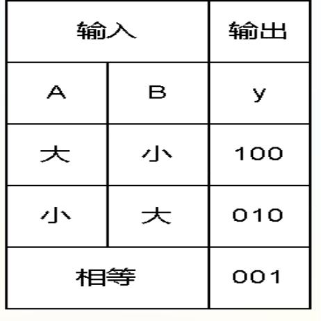    
2个 4 位二进制多功能运算器`operator_display`:  
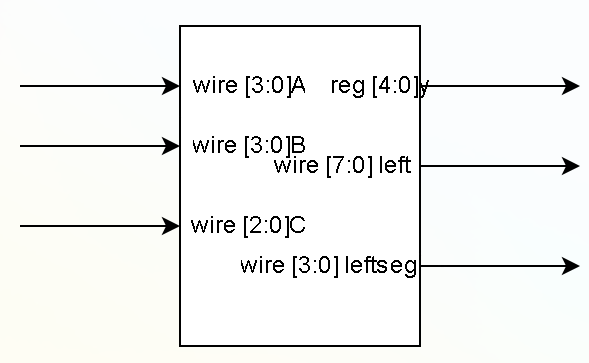    

#### 5. [触发器](./project/5-32Dff_p_Ap)
D 触发器`Dff_p`:  
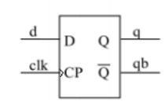
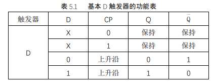    
带有置位/复位端口的 D 触发器`Dff_p_Sp`:  
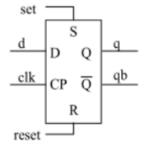
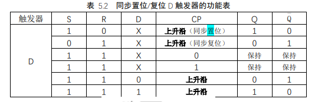    
32位通用寄存器`Dff_p_Ap_32`:  
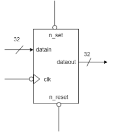    

#### 6. [分频器](./project/6-slowclock)  
模10计数器`counter_10`:  
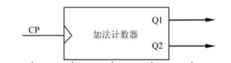    
分频器`slowclock`:  
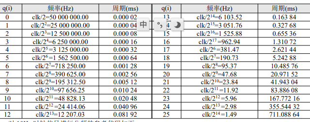
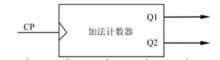    

#### 7. [移位寄存器](./project/7-ShiftReg_led)
4 位的循环右移寄存器`ShiftReg`:  
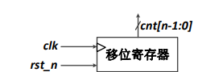    
具有初值设定功能的 4 位右移移位寄存器`ShiftReg_I`:  
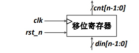    
一个利用可控左移/右移移位寄存器实现的跑马灯电路`ShiftReg_led`:  
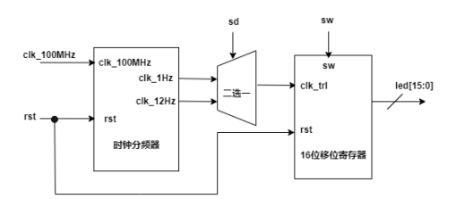    

#### 8. [状态机](./project/8-Calendar)
11001序列检测器`t_11001`:  
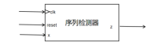    
显示年月日`Calendar`:  
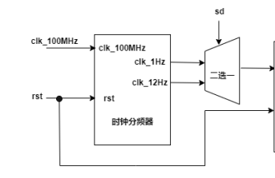    

